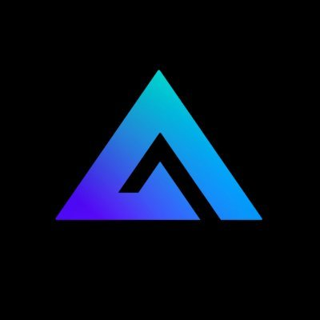
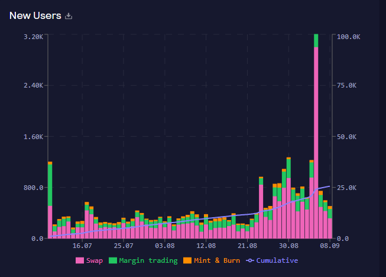

# **Module-1-HW: GMX.IO**

---
## *Overview and Origin:*
The name of the project I chose was **GMX.IO**. This decentralized exchange went live on September 14th of 2021 at an opening price of $14.99. Due to the nature of this decentralized platform, the founders of this project are currently anonymous, so we'll likely never know exactly who the founders are. The idea for the project came about due to the need of a platform/exchange that allows spot and perpetual leverage trading that is decentralized. Many in the crypto community are in the community solely for its decentralized nature. Currently, it's easiest to trade with leverage on centralized exchanges such as Binance. By creating a decentralized exchange that can fulfill this function, there's a large market for those in crypto who would prefer to conduct their trades on this decentralized platform. The company is funded by investors in the crypto space who plan to use the decentralized exchange. As a DeFi exchange, GMX needs capital to be deposited as liquidity in their trading pools, and this is where the funding goes to. It is impossible to know who exactly has funded the project as well as how many people, however, we can get a sense of the amount of funding by looking at the projects total value locked (TVL). According to [Defi Llama](https://defillama.com/protocol/gmx), current funding stands at approximately $400 million. 

---
## *Business Activities:*
The use of a decentralized exchange that can be used for spot and perpetual trading with leverage was designed to solve two problems: The first being to use a different model than the traditional orderbook model that is reliant on market makers. Order books will list the buys/sells that are being offered at each respective price. This model relies on costly incentives for market makers as well as numerous people being active and present on the exchange to provide liquidity at various prices. Instead, GMX.IO uses an automated market maker (AMM). This model uses liquidity pools that allow digital assets to be traded instantaneously instead of using traditional markets of buyers/sellers. The AMM users supply liquidity pools with a basket of acceptable crypto tokens whose prices are determined by a constant mathematical formula. This solves the first issue of decentralized exchanges typically being illiquid, and allows for quick executions with very low fees. Secondly, when it comes to using centralized exchanges (Binance, Coinbase, etc), you do not own the keys to your tokens/assets. If the exchange were to fail, anything that you held/owned on that exchange could potentially be lost. In a decentralized exchange, you're in charge of the custody of your tokens/assets. The only loss that could be incurred would be from depreciation of the asset, but you wouldn't have the possibility of losing custody of said tokens.
>
The companies intended customer would be anyone in the crypto space with interest in either trading spot/perpetual with leverage, or anyone interested in providing liquidity by staking their tokens to earn yield. You can [stake](https://app.gmx.io/#/earn) GMX directly for a 14.53% APR, or you can stake your money in the GLP liquidity pool for 28.89% APR. GMX can be purchased/used via the Arbitrum or Avalanche blockchain. At the time of writing this, according to GMX's [website](https://stats.gmx.io/), there are currently 83,109 users using Arbitrum and 14,006 users using Avalanche, giving us a total of 97,115 users on the platform. 
>

>
The solution that GMX offers vs its competitor is two-fold. First, they offer an AMM that was discussed earlier. Second, as of now, they also use 100% of the fees they generate via trading and actually pass that back to their users. 30% of fees are used to fund those who stake GMX for a yield, and the other 70% goes to their GLP pool, which is their liquidity basket of certain acceptable tokens. This way, GMX is simultaneously providing customers with yield, and helping provide liquidity for their users as well. As more and more users begin to pour in due to the rewards and liquidity, those users consequently also begin to provide liquidity as more users == more fees == more liquidity provided to the GLP pool. Furthermore, GMX also pays out their staking yield in the native token of the chain that you're staking on. For example, if you stake GMX using Avalanche, you will receive your rewards in AVAX token. If you stake GMX using Arbitrum (L2 of Ethereum), you will receive ETH. Due to this mechanism, you can also reduce your risk by diversifying your staked GMX into different tokens (AVAX/ETH).
>
Two different types of technology used in GMX include blockchain technology as well as using Chainlink Oracles for dynamic pricing. The blockchain technology is used via Avalanche and Arbitrum as a way to buy the GMX token and use the product. Chainlink Oracles are used to provide pricing data for the tokens that are included in their liquidity pool. By using Chainlink Oracles for pricing, the AMM has dynamic pricing that are used on aggregated data across many exchanges, allowing large wicks from liquidations to be less severe on the liquidity pool pricing.

---
## *Landscape:*
The domain of the project is in the blockchain and cryptocurrencies. Major trend and innovations within this domain include decentralized peer to peer transactions, major innovations in privacy and security within transactions (tornado cash), the overall development of web3 (taking ownership of one's own data), NFT's, smart contracts, etc. Some other major companies in this domain include Coinbase, Binance, dYdX, Kucoin, kraken, FTX, and many more.

---
## *Results:*
The business impact of GMX thus far has been significant since its inception, especially considering how new it is. The GMX token has more than [tripled](https://www.coingecko.com/en/coins/gmx) since it started trading at ~$15. The price of the token as of writing stands at $50.99. GMX has also held up very strongly in the current crypto bear market, with its market cap now surpassing ~$400,000,000. This overtakes some of GMX's strongest competitors with [dYdX](https://www.coingecko.com/en/coins/dydx) sitting at ~$200,000,000 market cap and [PERP](https://www.coingecko.com/en/coins/perpetual-protocol), sitting at ~$51,000,000 market cap. Furthermore, the overall hype and excitement around this project has been spreading across many social media platforms, in which large swaths of the crypto community have been raving GMX's name. 
>
Three of the most important metrics to measure companies in this domain include volume, fees generated, and users. First, I'll begin by listing GMX's performance in relation to these metrics, and then I will present those same metrics for what is considered to be GMX's largest competitor at the moment, **dYdX**. To begin, we can look back at GMX's [stats page](https://stats.gmx.io/). Here we can see that GMX's cumulative volume has been on a steady increase since inception. If we switch the time frame to "all time", total cumulative volume has reached ~$47 billion. On the right-hand side of the page, we can see the fees that have been generated via trading. Total fees thus far have accumulated to ~$62 million. Finally, as discussed before, GMX's total users is somewhere around ~97,000.
>
Now, let's take a look at these same statistics but for dYdX. To begin, we can take a look at some statistics I found [here](https://nomics.com/exchanges/dydx). Similarly, if we switch to "YTD", we can get a nice overview of the total volume under this exchange since inception. DydX has generated a cumulative $320 billion in volume. However, there is something of importance to note here. As of right now GMX only supports trading for four tokens- ETH, BTC, LINK, and UNI. DydX on the other hand offers trading for over 30 tokens. As more users join GMX, and overall liquidity begins to increase, GMX will be able to add more tokens that will be able to be traded and begin to largely outperform dYdX in regard to volume. Looking at fees, [Messari Crypto](https://twitter.com/MessariCrypto/status/1561518532646514689) provided this research. It shows that GMX has annualized total fees of $100 million where as dYdX has around $340 million. Again there is a large difference here largely in part due to the lower amount of tradable coins on GMX. This will likely increase as more users join. Finally, dYdX as 64,000 users, where as GMX has 97,000 users. Although dYdX has GMX currently beat in volume and fees, if you take a look at the volume chart provided earlier, a steady decline can be seen in trading volume for dYdX where as GMX has seen a sharp incline. I believe over the long term GMX will eventually flip dYdX in both these metrics and eventually be the most popular/lucrative decentralized perp exchange.

---
## *Recommendations:*
If I were to advise the company, I would advise them of two things. The first would be to attempt to introduce as many tradeable tokens as they can as quickly as possible so they can continue to outcompete others such as dYdX. By introducing more tokens that can be traded, they could bring in more users and thus more liquidity and then increase the volume on their exchange, as well as bolster their fees generated. The second thing I would advise would be to offer a wider range of trading opportunities. For example, as of now they offer up to 30x leverage on leveraged trades. I think ultimately they should aim to offer up to 100-125x leverage just as [Binance](https://www.binance.com/en/futures/trading-rules/perpetual/leverage-margin), a centralized exchange does.This will likely become more attainable as active users and liquidity increase. Furthermore, they could offer more financial products like potentially the ability to trade options and other derivative products that current exchanges do not offer. These recommendations would require additional blockchain technologies in order to be able to trade additional coins on the decentralized platform. They would also require coded and fleshed out programs and pricing software to properly price and update values of derivative contracts. Finally, these derivative contracts would also require the use of smart contract technology to ensure the fulfillment of obligations by both parties. By no means would it be simple to introduce more derivatives especially in a decentralized landscape, but it is an area of the crypto universe that is yet to properly be introduced and could provide massive growth to the exchange if done correctly. 

---
## *Further Reading:*
If you wish to learn more about GMX and their competitors, I've provided some links that you may find useful:
>
*[Stats](https://stats.gmx.io/)*
>
*[Roadmap, Tokenomics, Rewards, etc](https://gmxio.gitbook.io/gmx/)*
>
*[Comparative valuation vs Competitors](https://research.thetie.io/gmx-valuation-vs-dydx/#GMX_vs_Peers)*
>
*[GMX Staking/GLP Liquidity Pool](https://chaindebrief.com/all-you-need-to-know-about-gmx/)*
